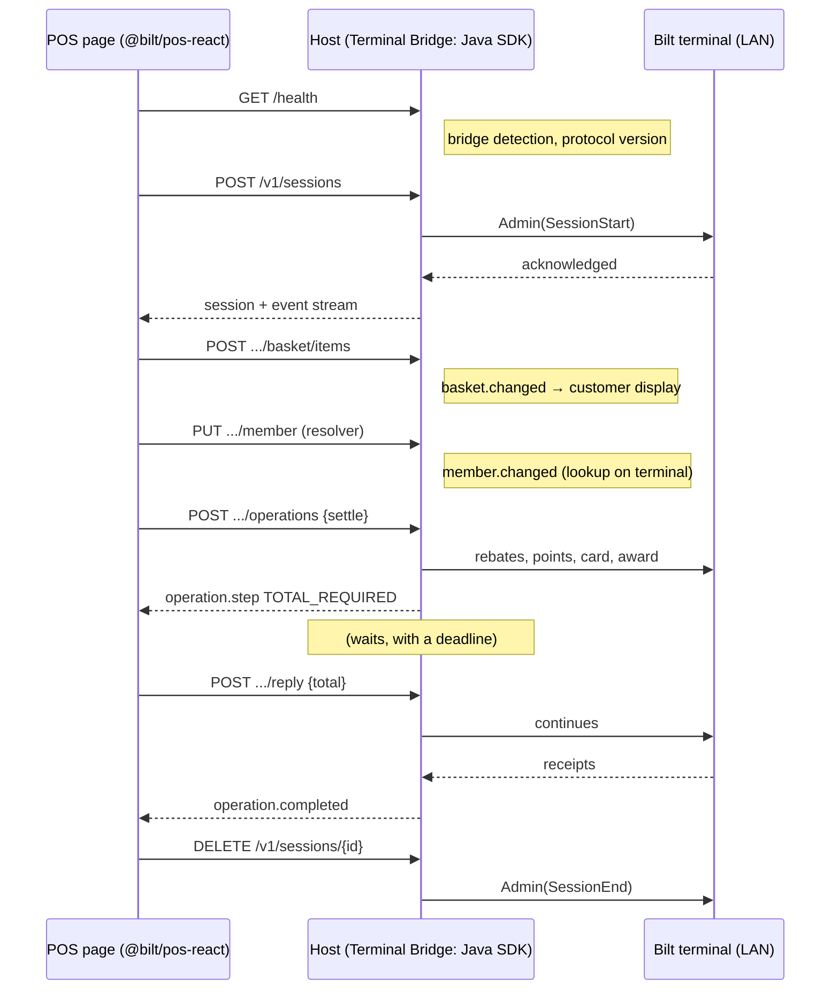

---
---

# JavaScript SDK — Integration Guide

The JavaScript SDK runs a Bilt checkout from a browser page. It is the JavaScript form of [`ShopperSession`](./shopper-session-integration.md) and [`TerminalShopperSession`](./checkout-session-integration.md): the same basket, member, context, settlement, reversal and widget vocabulary, over a **host** that embeds the Java SDK and does the terminal work. Today that host is the [Terminal Bridge](./terminal-bridge.md) on the register machine; later it is also the Cloud Session Service, behind the same API.

This guide covers `@bilt/pos-sdk` (framework-free) and `@bilt/pos-react` (hooks and components). Every sample on this page is compiled from [`js/examples/browser-pos/src/guide-samples`](https://github.com/biltrewards/bilt-pos-sdk/tree/main/js/examples/browser-pos/src/guide-samples) in CI, and the [browser POS example](#the-example) puts them together into a register.

---

## Before you begin

Make sure you have:

1. A lane id (`saleId`) for each register and the store location id (`storeLocation`) it belongs to.
2. For a terminal session: a boarded terminal and a host that reaches it. In development that is the Terminal Bridge with the terminal in its config file, as the [setup guide](./terminal-bridge.md) describes, or the [Session Host](./session-host.html) started from this repository.
3. Node 20 and a bundler that handles ES modules (Vite, Next, webpack 5). The packages ship ESM and CommonJS builds with type declarations.

```sh
pnpm add @bilt/pos-sdk @bilt/pos-protocol        # the core
pnpm add @bilt/pos-react react                    # the React layer, optional
```

---

## Mental model

- **The browser never talks to the terminal.** The terminal is reached by IP over HTTPS with a private CA and encrypted payloads; neither belongs in a page. The page talks the [Session Protocol](./session-protocol-reference.html) (HTTP plus an event stream) to a host, and the host runs the Java settlement engine against the terminal. Nothing Nexo leaks: errors are `SessionError` codes, results are the structured models.
- **A session is a resource on the host.** `BiltPos.connect(...)` gives you a connection; `startTerminalSession(...)` or `startShopperSession(...)` creates a session on the host and hands back an object whose basket, member and context mirror the host's. Reads are synchronous (`session.basket.current`), writes return promises, and every change arrives as an event (`basket.changed`, `member.changed`, ...) after the mirror was updated.
- **Operations are promises.** What is a lazy `SessionResult` or `SettlementFlow` in Java is an `Operation<T>` here: it is on its way the moment the method returns, `await` it for the result, hold it for `status` and `abort()`. Operations on one session run one at a time, in order, as on the Java session's operation thread. There is no `execute()`.
- **Register callbacks are steps with deadlines.** Where the Java `SettlementFlow` blocks on your handler (the total after rebates, the recovery decision after a decline), the host emits a step with a deadline and a default, and the SDK calls the handler you passed to `settle()`. A missing or late answer takes the documented default, the Java SDK's own, so a page cannot wedge a payment.
- **Engines differ in capabilities, not in API.** `localBridge()` and, later, `cloud(...)` are engines behind one `BiltPos`. Whether a settlement survives a page reload or works through an internet outage is data on `pos.capabilities`, not a different method.
- **Widgets run on the host; the page renders.** The host decides what the retail-media placement shows and validates every tap. The page draws `widget.rendering` events (or lets `RetailMediaSurface` do it) and acts on `widget.offer`.



---

## Packages

| Package | What it is | Source |
|---|---|---|
| `@bilt/pos-protocol` | The TypeScript domain model and a typed `fetch` client, generated from the Session Protocol spec. You rarely import it directly; `@bilt/pos-sdk` re-exports the types. | [`js/packages/protocol`](https://github.com/biltrewards/bilt-pos-sdk/tree/main/js/packages/protocol) |
| `@bilt/pos-sdk` | `BiltPos`, `ShopperSession`, `TerminalShopperSession`, `Operation`, settlement handlers, errors. `@bilt/pos-sdk/bridge` adds `localBridge()`, `detectBridge()` and the bridge errors. | [`js/packages/sdk`](https://github.com/biltrewards/bilt-pos-sdk/tree/main/js/packages/sdk) |
| `@bilt/pos-react` | `BiltPosProvider`, the session, basket, member, context, settlement and operation hooks, `RetailMediaSurface`. `@bilt/pos-react/bridge` adds `useBridge`, `InstallBridgePrompt`, `BridgeGate`. | [`js/packages/react/README.md`](https://github.com/biltrewards/bilt-pos-sdk/blob/main/js/packages/react/README.md) |
| Workspace | How the packages are built, tested and generated. | [`js/README.md`](https://github.com/biltrewards/bilt-pos-sdk/blob/main/js/README.md) |
| Example | The browser POS register this guide walks through. | [`js/examples/browser-pos`](https://github.com/biltrewards/bilt-pos-sdk/tree/main/js/examples/browser-pos) |

---

## Engines and capabilities

`BiltPos.connect(factory)` runs an engine factory, reads the host's `/health` and checks that it lists the protocol version this SDK was generated from. `localBridge()` from `@bilt/pos-sdk/bridge` is the engine for a Terminal Bridge on the register machine; `cloud(...)` for the Cloud Session Service follows in its own entry point. A register written against `@bilt/pos-sdk` runs unchanged over either.

What differs is reported on `pos.capabilities`:

| Capability | Terminal Bridge | Meaning |
|---|---|---|
| `name` | `"bridge"` | For diagnostics. |
| `survivesPageReload` | `true` | Sessions and in-flight operations live on the host, not in the tab. See [Reliability](#reliability). |
| `worksOffline` | `true` | The terminal is on the LAN; a checkout runs through an internet outage. |
| `supportsWidgets` | `true` | `widget.*` events are delivered when the host has an ad decision service. |
| `supportsTerminalSessions` / `supportsLocalSessions` | `true` / `true` | Which `start...Session` calls are available. |

```ts
export function describeEngine(pos: BiltPos): string {
  const { name, survivesPageReload, worksOffline, supportsWidgets } = pos.capabilities;
  return [
    `engine ${name}`,
    survivesPageReload ? 'a reload keeps the session' : 'a reload loses the session',
    worksOffline ? 'checkouts run through an internet outage' : 'checkouts need the internet',
    supportsWidgets ? 'widgets available' : 'no widgets',
  ].join(', ');
}
```

Bridge-only concepts (ports, detection states, install and update errors) live in `@bilt/pos-sdk/bridge` and `@bilt/pos-react/bridge`, never in the core entry points.

---

## Bridge detection and install

The bridge listens on `http://127.0.0.1:48333`, or the next free port up to `48343`. `detectBridge()` probes `GET /health` on every port of that range at once, 400 ms each, and reports one of three states; `localBridge()` runs the same probe inside `BiltPos.connect`:

| Detection | `BiltPos.connect(localBridge())` | What the register shows |
|---|---|---|
| `ready` | resolves with a `BiltPos` | the lane |
| `missing` (nothing answered) | rejects with `BridgeMissingError` (`probed` lists the URLs) | the install prompt, polling every two seconds until the bridge is up |
| `outdated` (a bridge answered without this SDK's protocol version) | rejects with `BridgeOutdatedError` (`required`, `available`) | the update prompt |

**Chrome's one-time loopback permission.** From Chrome 142 a page served from a public origin (`https://pos.example.com`) may only reach `127.0.0.1` after the user allows it once, per origin, in a browser prompt that appears on the first request. The SDK sends the `targetAddressSpace: "loopback"` hint that triggers the prompt correctly; the register should explain it before the first probe, which is what `InstallBridgePrompt` does, and with `autoDetect: false` it waits for the cashier to press *Continue* before probing at all. A dismissed prompt is remembered: the cashier resets it in the site settings. A page served from `localhost` itself is already loopback and is never asked. Managed fleets can pre-grant the permission by policy. Firefox does not ask; Safari is unconfirmed.

In React the whole flow is one component (see [React](#react) for the pieces):

```tsx
export function Register(): ReactNode {
  return (
    <BridgeGate downloadUrl={GUIDE_URL}>
      <BiltPosProvider connect={() => BiltPos.connect(localBridge())}>
        <Lane />
      </BiltPosProvider>
    </BridgeGate>
  );
}
```

`BridgeGate` renders `InstallBridgePrompt` until the probe says `ready`, then its children. The prompt links the installer for the cashier's platform from the update manifest (`manifestUrl`) when there is one, else `downloadUrl`; until the update feed exists point it at the [Terminal Bridge setup guide](./terminal-bridge.md).

Two development caveats, both lifted by the host's upcoming CORS option: the development bridge sends no CORS headers, so a page on another origin than the bridge must proxy `/health` and `/v1` through its own dev server (the example's `vite.config.ts` does); and the bridge enforces `allowedOrigins` server-side (`401`, surfacing as `UNAUTHORIZED`) rather than through CORS.

---

## Connect

```ts
export async function connect(): Promise<BiltPos> {
  try {
    return await BiltPos.connect(localBridge());
  } catch (error) {
    if (error instanceof BridgeMissingError) {
      showInstallPrompt(error.probed); // the health URLs that stayed silent
    } else if (error instanceof BridgeOutdatedError) {
      showUpdatePrompt(error.required, error.available); // protocol versions
    } else if (error instanceof EngineError) {
      showHostUnavailable(error.message); // any other engine failure
    }
    throw error;
  }
}
```

`BridgeMissingError` extends `EngineUnavailableError` and `BridgeOutdatedError` extends `EngineOutdatedError`, both `EngineError`s, so a register that only wants "no host" versus "host too old" catches the base classes and stays engine-neutral. `localBridge()` takes options when the defaults do not fit: `host`, `port`, `fallbackPorts`, `healthTimeoutMs`, `retries` (for requests that never reached the bridge, default 2), `fetch`, `webSocket`, `eventSource`, and `bearerToken` for the day pairing exists.

`pos.close()` releases the connection; sessions on the host are untouched (end them first with `session.end()`). `BiltPos` is async-disposable.

---

## Start and end a session

A **terminal session** is bracketed on a terminal: it exists once the terminal acknowledged the start, and `end()` tells the terminal to discard its session-scoped data. A **local session** has no terminal: basket, member, context and widgets for a lane without hardware, or for a register that only wants the bookkeeping.

```ts
export async function startLane(pos: BiltPos): Promise<TerminalShopperSession> {
  const session = await pos.startTerminalSession({
    saleId: 'LANE-3',
    poiId: 'VictaLane-275839164',
    currency: 'USD',
    storeLocation: 'STR-0142',
    widgets: [{ type: 'retail-media', placements: ['lane-banner'] }],
  });
  return session; // the terminal has acknowledged; a refused start rejects instead
}

export function startLocalLane(pos: BiltPos): Promise<ShopperSession> {
  return pos.startShopperSession({ saleId: 'LANE-3', currency: 'USD', storeLocation: 'STR-0142' });
}
```

The options are the Java builders' fields: `saleId`, `currency`, `storeLocation` (required for retail media), an initial `member`, the starting `phase` and `attributes`, `widgets`, `rendering` capabilities, and for a terminal session `poiId` and `autoDisplay` (default `true`: basket changes refresh the customer display). A refused start (terminal unreachable, unknown `poiId`, a session already open on the terminal) rejects with a `SessionError` and creates nothing.

A session lives for one shopper's visit and may run several settlements, with `basket.clear()` between them. It ends once:

```ts
export async function endLane(session: TerminalShopperSession): Promise<void> {
  try {
    await session.end();
  } catch (error) {
    if (error instanceof SessionError && error.code === 'INVALID_STATE') {
      // Money is unresolved: finish the unwind first (retry settle(), voidTransaction()), or,
      // once the incident is recorded for reconciliation, abandon it explicitly.
      recordIncident(error.message);
      await session.forceEnd('operator escalated incomplete recovery');
      return;
    }
    throw error;
  }
}
```

`end()` is refused, with the session left open, while money is in flight, while a failed settlement's rollback is incomplete, while a void is partially complete, or while refund allocations from a failed settlement have committed. `forceEnd(reason)` bypasses those guards (not an active money movement) and seals the session either way. Sessions are async-disposable, so a scoped visit needs no explicit end:

```ts
export async function oneVisit(pos: BiltPos): Promise<void> {
  await using session = await pos.startTerminalSession({
    saleId: 'LANE-3',
    poiId: 'VictaLane-275839164',
    currency: 'USD',
  });
  await session.basket.addItem({
    sku: 'GRC-OJ-1L',
    description: 'Orange Juice 1L',
    unitPrice: '4.49',
  });
  await session.settle();
} // end() runs here, best-effort: a refusal is reported, not thrown
```

Device and admin operations need no session. `pos.terminal(poiId)` is the Java `Terminal` facade, and `session.terminal()` the same thing on its own exchange, so a connectivity check never queues behind a payment:

```ts
export async function beforeOpening(pos: BiltPos): Promise<void> {
  const terminal = pos.terminal('VictaLane-275839164');
  const diagnosis = await terminal.diagnose();
  console.log(diagnosis.hostStatuses);
  const totals = await terminal.totals(); // running totals; reconcile() closes the period
  console.log(totals.transactionTotals);
}
```

---

## Build the basket

The basket is the Java `SessionBasket`: one place for items, discounts, tax and totals, with every mutation returning the new `Basket` and producing exactly one `basket.changed`. Amounts are `Money`, decimal strings such as `"24.99"`, never floats. There are three ways to update it, for three kinds of register:

```ts
// Incremental, as the cashier scans: a repeated SKU bumps its quantity, 0 removes the line.
export function scan(session: ShopperSession, item: BasketItem): Promise<Basket> {
  return session.basket.addItem(item);
}

export function setQuantity(session: ShopperSession, sku: string, qty: number): Promise<Basket> {
  return session.basket.updateItemQuantityBySku(sku, qty);
}

// Batch: several lines in one atomic change, one basket.changed, one display refresh.
export function exchange(session: ShopperSession): Promise<Basket> {
  return session.basket.mutate((m) =>
    m
      .removeItemBySku('KRK-CNDL-LRG-VAN')
      .addItem({ sku: 'KRK-FRAME-5X7-BLK', description: '5x7 Black Frame', unitPrice: '14.99' })
      .setTaxTotal('1.33'),
  );
}

// Replace: a POS that owns its cart pushes the whole thing after every change.
export function syncCart(session: ShopperSession, cart: readonly BasketItem[]): Promise<Basket> {
  return session.basket.replace(cart);
}
```

`replace` pairs lines with the current basket by `reference` when present, otherwise by SKU and type, and paired lines keep their item ids; a snapshot equal to the current basket produces no change. If any step of a `mutate` is invalid the basket is left untouched. Each line also takes register discounts and tax:

```ts
// Discounts and tax live on the lines.
export async function applyCoupon(session: ShopperSession, itemId: string): Promise<Basket> {
  await session.basket.setDiscounts(itemId, [
    { reference: 'CPN-10', label: '$1 off', amount: '1.00' },
  ]);
  return session.basket.setTaxRate(itemId, '0.08875');
}

// Between two settlements in one session.
export function nextBasket(session: ShopperSession): Promise<Basket> {
  return session.basket.clear();
}
```

`setTaxRate` makes the host compute `taxAmount = subtotal × rate`; `setTaxAmount` fixes an amount instead; `setTaxTotal` overrides the basket's total tax (`null` restores line-level computation). Sale, return and credit lines (`type`) coexist in one basket. Mutations are refused once the session ended, and on a terminal session while money is moving and after the current basket settled; `clear()` starts a fresh cart with a new cart id.

`basket.changed` carries the `BasketChange` diff, with the `source` (`INCREMENTAL`, `BATCH`, `REPLACE`, `CLEAR`) and the added, removed and changed lines:

```ts
export function watchBasket(session: ShopperSession): () => void {
  return session.on('basket.changed', (change) => {
    render(change.current); // session.basket.current already equals change.current here
    for (const line of change.added) log(`${change.source}: added ${line.sku}`);
  });
}
```

---

## Identify the member

A member attaches with an `id` the register knows, or with a **resolver**: an identifier on file (`PHONE`, `ACCOUNT_ID`, `EMAIL`, or a retailer `CUSTOM` type) that the host looks up in the background, on the terminal for a terminal session. Until the lookup completes the member is pending and the visit is a guest's. `keyedByCashier` says the cashier typed it (the terminal lookup then sends `EntryMode=Keyed`). In events and responses the value comes back masked.

```ts
export async function knownShopper(session: TerminalShopperSession): Promise<void> {
  // A member id attaches at once.
  await session.member.set({ id: 'mbr_8f2a' });
  // A resolver attaches as pending; the host looks it up and announces the result.
  await session.member.set({
    resolver: { type: 'PHONE', value: '+12015550123', keyedByCashier: true },
  });
  // Sign out.
  await session.member.clear();
}

export function followMember(session: TerminalShopperSession): () => void {
  return session.on('member.changed', ({ member }) => showMember(member));
}
```

Every change, from the register, a terminal prompt or a completed lookup, is a `member.changed`, and `session.member.current` follows it. A `Member` is `resolved` with a `memberId`, `loyaltyBrand`, `rewards` and `pointBalance`, or pending with its `resolver`.

On a terminal session the shopper can also identify on the device. Outcomes that leave the checkout without a member resolve with their status; only real failures reject:

```ts
export async function identifyOnTerminal(session: TerminalShopperSession): Promise<boolean> {
  const result: IdentifyResult = await session.identifyMember();
  switch (result.status) {
    case 'FOUND':
      return true; // attached to the session; member.changed has fired
    case 'NOT_FOUND':
    case 'SUSPENDED':
    case 'CANCELLED':
    case 'ERROR':
      return false; // guest checkout; only real failures reject
  }
}

export function lookupWithoutPrompt(session: TerminalShopperSession): Promise<IdentifyResult> {
  return session.identifyMember({ resolver: { type: 'ACCOUNT_ID', value: 'ACC-77' } });
}
```

The prompt-less lookup takes account ids and phone numbers; an email or custom identifier rejects with `UNSUPPORTED`. `identifyMember()` is available after a failed settlement too, so a declined guest checkout can attach a member and retry with loyalty.

---

## Session context

The context is the checkout phase (`SCANNING`, `MEMBER_IDENTIFIED`, `TENDERING`, `COMPLETE`) and free-form attributes that widgets use for eligibility and targeting. Pure bookkeeping, nothing reaches the terminal; a terminal session moves the phase itself around settlement.

```ts
export async function markTendering(session: ShopperSession): Promise<void> {
  await session.context.setPhase('TENDERING');
  await session.context.setAttribute('lane-type', 'pharmacy');
  await session.context.removeAttribute('promo-code');
  const snapshot = session.context.snapshot(); // phase, attributes, saleId, currency, storeLocation
  console.log(snapshot.phase, session.context.attributes());
}
```

---

## Settle

`session.settle(options)` runs the settlement sequence the [TerminalShopperSession guide](./checkout-session-integration.md#the-settlement-sequence-explained) describes: refund allocations, rebate redemption, point redemption, stored value, card charge, award. The one options object takes the Java `SettlementOptions` (`settlementType`, `disableRebates`, `disablePoints`, `disableAward`, `cashback`, `refunds`, `fulfillments`, `paymentProcessingDisplay`) and the `SettlementFlow` handlers side by side.

### Steps, deadlines and defaults

Three handler groups are **steps**: the host pauses the sequence, asks the register, and applies a default when no answer arrives by the deadline. Each handler receives a `StepInfo` with the `deadline` and an `AbortSignal` that fires at it, so a slow tax service or a cashier prompt can be cut off in time.

| Handler | Step | Reply | Default at the deadline |
|---|---|---|---|
| `beforeStep(context, step)` | `BEFORE_STEP` | the `SaleTransactionID` for the next step, or nothing | the basket's shared transaction id |
| `onRebatesRedeemed`, `onPointsRedeemed`, `onGiftCardPayment` | `TOTAL_REQUIRED` | the running total for the next step | `result.suggestedTotal`: previous total minus the step's amount |
| `onError(failure, step)` | `RECOVERY_REQUIRED` | `RETRY`, `SKIP`, `{ action: 'EXTERNAL', externalPayment }`, `ABORT`, `ABANDON` | `ABORT` |

Deadlines are the host's (30 seconds for totals, 120 for recovery decisions by default) and the SDK never extends them. A handler that is absent does not hold the sequence at all: the SDK tells the host which steps it handles, and the rest resolve to their defaults host-side without a round trip, exactly as an unregistered Java handler. The movement callbacks (`onMovement` and the per-step `onCardCharged`, `onAwarded`, `onCardRefunded`, ...) are observations with no reply; `SettlementResult.movements` is the authoritative ledger, since an abort or a same-run recovery can reverse charge-side movements without a compensating callback.

```ts
export function pay(session: TerminalShopperSession): Promise<SettlementResult> {
  return session.settle({
    // TOTAL_REQUIRED after rebates: re-tax the rebated lines, within the step's deadline.
    onRebatesRedeemed: (rebates, step) => taxService.total(rebates.updatedBasket, step.signal),
    // Points and a gift card are tender, not price changes: the suggested total is right.
    onPointsRedeemed: (points) => points.suggestedTotal,
    onGiftCardPayment: (giftCard) => giftCard.suggestedTotal,
    // Observations as they commit; SettlementResult.movements is the ledger.
    onMovement: (movement) => ledger.record(movement),
    // RECOVERY_REQUIRED: a charge-side step failed; answer within the deadline or ABORT applies.
    onError: (failure, step) => decideRecovery(failure, step),
    onAbandoned: (record) => ledger.file(record),
  });
}
```

### Recovery decisions

A charge-side failure (`SettlementFailure`) names the `step`, the `error`, the `amountDue`, the `committedMovements` so far and the `outcomeCertainty`. When the terminal outcome is `INDETERMINATE` (a transaction status check could not establish it), `SKIP` and `EXTERNAL` are refused: the step must be retried or the settlement aborted. `ABORT` unwinds everything the charge sequence committed, in reverse order, and leaves the basket intact so `settle()` can run again; `ABANDON` stops without unwinding and hands the register an `AbandonedSettlementRecord` for reconciliation. A refund-allocation failure also arrives here, as a notification whose answer is ignored.

```ts
async function decideRecovery(
  failure: SettlementFailure,
  step: StepInfo,
): Promise<SettlementRecovery | SettlementRecoveryAction> {
  if (failure.outcomeCertainty === 'INDETERMINATE') return 'RETRY'; // SKIP and EXTERNAL are refused
  const choice = await cashier.chooseRecovery(failure, step.signal); // aborts at step.deadline
  return choice === 'EXTERNAL'
    ? { action: 'EXTERNAL', externalPayment: { tenderType: 'CASH', amount: failure.amountDue } }
    : choice;
}
```

### Outcome

The operation resolves with a `SettlementResult` (amounts per tender, rebates, points, earned rewards, the customer and merchant `Receipt`s with `plainText`, `html` and structured `receiptData`, and `movements`) or rejects with a `SessionError`:

```ts
export async function payAndReport(session: TerminalShopperSession): Promise<void> {
  try {
    const result = await pay(session);
    print(result.customerReceipt?.plainText);
  } catch (error) {
    if (!(error instanceof SessionError)) throw error;
    if (error.code === 'ABORTED') return; // unwound; the basket is intact and settle() may run again
    if (error.abandonedSettlement) ledger.file(error.abandonedSettlement);
    showError(error.code, error.message);
  }
}
```

A successful settlement consumes its basket; `basket.clear()` starts the next one in the same session. A failed one leaves the basket reusable for a retry (with the same committed refund-allocation prefix, when any committed).

### Progress and abort

The `Operation` is also a handle. Its `status` moves through `queued`, `running`, `awaitingReply` (a step is waiting on the register) and ends in `succeeded`, `failed` or `aborted`; `abort()` stops a payment at its next step boundary and unwinds it, delivers a prompt's cancelled outcome, and does not stop a void or an `end()`:

```ts
export async function payWithProgress(session: TerminalShopperSession): Promise<void> {
  const operation = session.settle(); // on its way already; no execute()
  const timer = setInterval(() => showStatus(operation.status), 250); // queued, running, awaitingReply, ...
  cancelButton.onclick = () => void operation.abort(); // stops at the next step boundary and unwinds
  try {
    await operation;
  } finally {
    clearInterval(timer);
    cancelButton.onclick = null;
  }
}

export function netSettlement(session: TerminalShopperSession): Promise<SettlementResult> {
  return session.settle({ settlementType: 'NET', disableAward: true });
}
```

`settlementType: 'NET'` sends only the signed basket difference (a charge, a refund, or no money movement) instead of the default `REFUND_THEN_CHARGE`. Split tender with a gift card is `session.setStoredValueCard(card)` before `settle()`; the stored value lifecycle (`storedValueBalance`, `storedValueActivate`, `storedValueLoad`, ...) is on the session as in Java.

---

## Refund and void

Reversals take an optional `ReversalHandlers` with one step handler, `onError(step, error, info)`, the Java `ReversalFlow.onError`: it answers `RETRY`, `SKIP` or `ABORT` for the leg that failed (`REVERSAL_DECISION_REQUIRED`, default `ABORT`). Without a handler the Java default policy applies: a failed money leg aborts, a failed loyalty leg riding along is skipped, a failed loyalty leg that is the substance of the reversal aborts.

```ts
export function refundLast(session: TerminalShopperSession, amount?: Money): Promise<RefundResult> {
  return session.refund(amount); // full when amount is omitted; the award is reversed best-effort
}

export function refundWithoutASale(session: TerminalShopperSession): Promise<RefundResult> {
  return session.refundUnlinked('12.00');
}

export function voidLast(session: TerminalShopperSession): Promise<VoidResult> {
  return session.voidTransaction(undefined, {
    onError: (step, error, info) => {
      log(`void step ${step ?? 'none'} failed with ${error.code}; deadline ${info.deadline}`);
      return step === 'AWARD' ? 'SKIP' : 'ABORT'; // a retried void resumes at the first leg still standing
    },
  });
}

export function voidPriorSale(
  session: TerminalShopperSession,
  record: OriginalSaleRecord,
): Promise<VoidResult> {
  return session.voidTransaction(record);
}
```

`refund()` and the parameterless `voidTransaction()` refer to this session's most recent successful settlement; after a split tender `refund()` references the card leg and `voidTransaction()` reverses both. A void reverses every movement the sale committed, money legs first, then redemption, rebate and award, and until a partially failed void succeeds the session refuses `basket.clear()`, another `settle()` and `end()`. `voidTransaction(record)` reverses a prior sale from its persisted `OriginalSaleRecord`.

---

## Widgets and RetailMediaSurface

A retail-media widget is configured on the session (`widgets: [{ type: 'retail-media', placements: ['lane-banner'] }]`, with `storeLocation` set). The host runs the widget and the ad platform; the page renders. Renderings arrive as `widget.rendering` and `widget.clear` events per placement, the page reports what the shopper did through `session.widget('retail-media')`, and a validated tap comes back as a `widget.offer`, the one event the register must act on: apply it to its own pricing (the example applies it as a line discount). The page cannot invent an offer; a foreign, stale or tampered token is rejected on the host and surfaces as a `background.error`.

In React, `RetailMediaSurface` is the whole browser half:

```tsx
export function LaneBanner({ session }: { session: ShopperSession | null }): ReactNode {
  useSessionEvent(session, 'widget.offer', ({ offer }) => applyOffer(offer));
  return (
    <RetailMediaSurface
      session={session}
      placement="lane-banner"
      viewabilityMs={1000}
      dismissible
      onRendering={(rendering) => console.log(rendering ? rendering.creativeId : 'cleared')}
    />
  );
}
```

It draws an image, a muted autoplaying video with its poster, or an HTML creative in a sandboxed iframe with no access to the page, plus the headline, body and up to two call-to-action buttons; reports `viewed` once after the rendering has been on screen for `viewabilityMs`, `dismissed` from its close control and `completed` when a video ends; and is headless, a `div` with `bilt-rm-*` class names and `data-placement` / `data-state` / `data-media` attributes for your stylesheet. Add a Content Security Policy `frame-src` for the creative CDN when HTML creatives are enabled.

Without React, the same protocol by hand:

```ts
export function drawYourself(session: ShopperSession): void {
  const widget = session.widget('retail-media');
  session.on('widget.rendering', ({ placement, rendering }) => {
    draw(placement, rendering, {
      onTap: (cta) => void widget.perform(rendering, cta), // the token goes back exactly as received
      onSeen: () => void widget.viewed(rendering), // once, after about a second on screen
      onClose: () => void widget.dismissed(rendering),
    });
  });
  session.on('widget.clear', ({ placement }) => clear(placement));
  session.on('widget.offer', ({ offer }) => applyOffer(offer)); // validated by the host: act on it
  session.on('widget.interaction', (payload) => analytics(payload)); // measured, informational
}

export async function duringPinEntry(session: ShopperSession): Promise<void> {
  const widget = session.widget('retail-media');
  if (widget.inert) return; // could not attach (no ad service, no store location): the lane runs without it
  await widget.pause(); // clears its placements and keeps them clear
  // ...PIN entry on the shared display...
  await widget.resume();
}
```

A widget that could not attach is `inert` with its `error` saying why, and the checkout runs without it; a slow or unreachable platform is an empty placement, never a failed basket call. `session.widget()` on a session without that widget configured throws, as a programming error.

---

## Customer prompts and display

The terminal prompts of `TerminalShopperSession` are operations like any other: `requestConfirmation`, `requestDigitString`, `requestDecimalString`, `requestTextString`, `requestMenuEntry`, `requestSignature`, `requestAmountConfirmation`, the PIN prompts, `acquireCard`. `updateDisplay(basket | payload)` refreshes the customer display by hand (unnecessary with `autoDisplay`), and `updateInputDisplay(payload)` replaces the content of a prompt in progress without queueing.

```ts
export async function confirmReceipt(session: TerminalShopperSession): Promise<boolean> {
  try {
    return await session.requestConfirmation('Would you like a receipt?');
  } catch (error) {
    if (!(error instanceof SessionError)) throw error;
    switch (error.code) {
      case 'CANCELLED': // the shopper backed out on the terminal
      case 'ABORTED': // the register called abort()
      case 'TIMEOUT':
        return false;
      case 'NETWORK':
      case 'TERMINAL_ERROR':
        showTerminalProblem(error.message, error.nexoErrorCondition);
        return false;
      default:
        throw error;
    }
  }
}
```

---

## Errors

Every rejected operation rejects with a `SessionError`, the JavaScript form of the Java one: a `code`, a `message`, the raw `nexoErrorCondition` when the failure came from the terminal, the `reversedMovements` a stopped void had already reversed, `details`, and `abandonedSettlement` after an `ABANDON` recovery. The engine-level errors are the only others the SDK throws, and only from `BiltPos.connect` and a lost host.

| `SessionError.code` | Typical cause |
|---|---|
| `NETWORK` | The host cannot reach the terminal, or the page lost the host mid-request after its retries. |
| `TIMEOUT` | A terminal exchange or a prompt timed out. |
| `DECLINED` | The card was declined; inside `settle()` this arrives as a `RECOVERY_REQUIRED` step first. |
| `CANCELLED` | The shopper cancelled on the terminal. |
| `ABORTED` | The register called `abort()`; a settlement has been unwound. |
| `ABANDONED` | The register answered `ABANDON`; `abandonedSettlement` carries the record. |
| `LOYALTY_UNAVAILABLE`, `STORED_VALUE_INSUFFICIENT` | The loyalty host is down, or the gift card cannot cover its share. |
| `INVALID_STATE` | A guard: a mutation while money moves, `end()` with money unresolved, `settle()` on a consumed basket, a terminal that already has a session. |
| `UNSUPPORTED` | An email or custom resolver in a prompt-less lookup; a provider without the stored value operation. |
| `TERMINAL_ERROR`, `UNKNOWN` | The terminal refused (see `nexoErrorCondition`) or failed unexpectedly. |
| `VALIDATION`, `NOT_FOUND`, `UNAUTHORIZED` | The host rejected the request: a malformed body, an unknown `poiId` or session, an origin the bridge does not allow. |

```ts
export function classify(error: unknown): string {
  if (error instanceof SessionError) return `session failure ${error.code}`;
  if (error instanceof EngineOutdatedError) return `host speaks ${error.available.join(', ')}`;
  if (error instanceof EngineUnavailableError) return 'no host answered';
  if (error instanceof EngineError) return 'engine failure';
  return 'something else';
}
```

`BridgeMissingError` and `BridgeOutdatedError` are the bridge's subclasses of the two engine errors, with `probed` and `baseUrl` respectively; see [Connect](#connect). Failures the SDK must not propagate (a throwing event handler, a rejected widget tap, a failed automatic display push, a step handler that threw) go to the session's `background.error` event and to `console.error`.

---

## Reliability

- **Requests retry safely.** Every state-changing request carries an idempotency key the SDK mints per intended request and reuses on retry, so a mutation retried after a dropped socket is answered with the original result, never applied twice. Requests that never reached the host are retried (`retries`, default 2); a request the host received but whose answer was lost is retried with the same key.
- **The event stream reconnects and replays.** The session's events come over a WebSocket (Server-Sent Events where WebSocket cannot be opened), each with a sequence number. On any drop the SDK reconnects with the last sequence it processed and the host replays from its buffer, with exponential backoff from 250 ms to 10 s; while disconnected it polls its pending operations, so a step that fell due in the gap is still answered. When the host can no longer replay from that position (a long outage), the SDK re-reads basket, member, context and pending operations and continues; a consumer sees each event once, in order.
- **Nothing a handler does blocks the session.** Handlers run after the mirror was updated; a throwing handler is reported, never propagated.
- **Settlement outlives the tab.** On the Terminal Bridge (`capabilities.survivesPageReload`) sessions and in-flight operations live on the host, so a page reload during a payment does not lose the payment: it continues to its outcome, a pending step takes its default at the deadline, and the terminal is left consistent. What this iteration of the SDK does **not** have is a call to reattach to that session from the new page: a reloaded page starts a new session, and a terminal that still holds the old one refuses the start with `INVALID_STATE` until the old session is ended (`DELETE /v1/sessions/{id}` on the bridge, or restarting it); the [bridge guide](./terminal-bridge.md#troubleshooting) has the steps. Keep the lane's session id in `sessionStorage` if you need to end it after a reload; resuming is a follow-up.
- **Offline.** The bridge reaches the terminal over the LAN, so a checkout runs through an internet outage; widgets then show empty placements and offer validation is refused, so the safe default is always the undiscounted price.

```ts
export function watchHealth(session: ShopperSession): void {
  // A rejected widget tap, a failed automatic display push, a step handler that threw.
  session.on('background.error', (error) => log.warn(`${error.code}: ${error.message}`));
  // The host ended the session, from this page or from another client of the same host.
  session.on('session.ended', ({ forced, reason }) =>
    log.info(forced ? `force-ended: ${reason ?? 'no reason'}` : 'ended'),
  );
}
```

---

## React

`@bilt/pos-react` turns the session into React state. The provider owns the connection; the hooks take a session (or `null`) and re-render on the matching event; nothing in the core entry point knows the bridge exists.

| Hook or component | Entry point | Returns / does |
|---|---|---|
| `BiltPosProvider` (`pos` or `connect`) | `@bilt/pos-react` | Holds the `BiltPos`; with `connect` it owns the connection and closes it on unmount. |
| `useBiltPos()` | `@bilt/pos-react` | `{ pos, status, error, reconnect }`; `status` is `connecting`, `connected`, `error`, `closed`. |
| `useTerminalSession(options, { enabled })` / `useShopperSession(...)` | `@bilt/pos-react` | `{ session, status, error, end, restart }`; starts on mount once connected, ends on unmount; `status` is `idle`, `starting`, `open`, `ending`, `ended`, `error`. |
| `useBasket(session)` | `@bilt/pos-react` | `{ basket, addItem, removeItem, updateItemQuantity, setDiscounts, setTaxRate, setTaxAmount, setTaxTotal, mutate, replace, clear, refresh, ... }`, following `basket.changed`. |
| `useMember(session)` | `@bilt/pos-react` | `{ member, set, clear, refresh }`, following `member.changed`. |
| `useSessionContext(session)` | `@bilt/pos-react` | `{ context, phase, attributes, setPhase, setAttribute, removeAttribute }`, following `context.changed`. |
| `useSettlement(session, { interactive })` | `@bilt/pos-react` | `{ settle, status, pendingStep, reply, movements, result, error, operation, abort, reset }`; steps listed in `interactive` are held open as `pendingStep` until `reply()`. |
| `useOperation(operation)` | `@bilt/pos-react` | `{ status, result, error, pending, abort }` for any `Operation` held in state. |
| `useSessionEvent(session, type, handler)` | `@bilt/pos-react` | Subscribes for the component's lifetime; the handler may be inline. |
| `RetailMediaSurface` | `@bilt/pos-react` | Draws one placement and reports `viewed`, `dismissed`, `completed` and taps. |
| `useBridge(options)` | `@bilt/pos-react/bridge` | `{ status, error, health, baseUrl, probed, attempts, platform, manifest, download, retry }`; polls while `missing` or `outdated`. |
| `InstallBridgePrompt` | `@bilt/pos-react/bridge` | The install, update and permission copy for a `useBridge` state; headless markup. |
| `BridgeGate` | `@bilt/pos-react/bridge` | `useBridge` plus the prompt: renders children once `ready`. |

A lane, end to end:

```tsx
function Lane(): ReactNode {
  const { session, status, error, restart } = useTerminalSession({
    saleId: 'LANE-3',
    poiId: 'VictaLane-275839164',
    currency: 'USD',
    storeLocation: 'STR-0142',
    widgets: [{ type: 'retail-media', placements: ['lane-banner'] }],
  });
  const { basket, addItem } = useBasket(session);
  const { member, set: signIn } = useMember(session);
  const settlement = useSettlement(session, { interactive: ['RECOVERY_REQUIRED'] });
  useSessionEvent(session, 'widget.offer', ({ offer }) => applyOffer(offer));

  if (status === 'error') {
    return (
      <p>
        Could not start the lane: {error?.message} <button onClick={restart}>Retry</button>
      </p>
    );
  }
  if (!session) return <p>Starting the lane…</p>;

  const step = settlement.pendingStep;
  return (
    <>
      <RetailMediaSurface session={session} placement="lane-banner" />
      <button
        onClick={() =>
          addItem({ sku: 'GRC-OJ-1L', description: 'Orange Juice 1L', unitPrice: '4.49' })
        }
      >
        Scan juice
      </button>
      <p>
        {member?.resolved ? `Member ${member.memberId}` : 'Guest'} · total {basket?.grandTotal}
      </p>
      <button onClick={() => signIn({ resolver: { type: 'PHONE', value: phoneFromInput() } })}>
        Sign in
      </button>
      {step?.kind === 'RECOVERY_REQUIRED' ? (
        <RecoveryPrompt
          failure={step.failure}
          deadline={step.deadline}
          onChoose={(recovery) => settlement.reply({ recovery })}
          onDefault={step.useDefault}
        />
      ) : (
        <button
          disabled={settlement.status !== 'idle'}
          onClick={() => settlement.settle({ onRebatesRedeemed: (r) => retax(r.updatedBasket) })}
        >
          Pay
        </button>
      )}
      {settlement.status === 'succeeded' && (
        <pre>{settlement.result?.customerReceipt?.plainText}</pre>
      )}
      {settlement.status === 'failed' && <p>{settlement.error?.message}</p>}
    </>
  );
}
```

`useSettlement` keeps the step semantics: only the kinds in `interactive` are held open as `pendingStep` (a `PendingTotalStep`, `PendingRecoveryStep` or `PendingBeforeStep`, each with `deadline`, `signal` and `useDefault()`); a handler passed to `settle()` for a step wins over the list; everything else takes its default at once; an unanswered `pendingStep` falls back to its default at the host's deadline. `settlement.status` runs `idle`, `running`, `awaitingReply`, then `succeeded`, `failed` or `aborted`; `reset()` returns to `idle` for the next shopper.

Any other operation is tracked by holding it in state:

```tsx
export function IdentifyButton({ session }: { session: TerminalShopperSession }): ReactNode {
  const [op, setOp] = useState<Operation<IdentifyResult> | null>(null);
  const identify = useOperation(op);
  return (
    <button onClick={() => setOp(session.identifyMember())} disabled={identify.pending}>
      {identify.pending ? `${identify.status}…` : 'Identify on terminal'}
    </button>
  );
}
```

And the bridge gate can be composed from its parts when the page wants the loopback-permission explanation before the first probe:

```tsx
export function ExplainedGate(): ReactNode {
  // autoDetect: false shows the loopback-permission note first; Continue runs the first probe.
  const bridge = useBridge({ autoDetect: false, pollIntervalMs: 2000 });
  if (bridge.status !== 'ready')
    return <InstallBridgePrompt bridge={bridge} downloadUrl={GUIDE_URL} />;
  return (
    <BiltPosProvider connect={() => BiltPos.connect(localBridge())}>
      <Lane />
    </BiltPosProvider>
  );
}
```

The hooks are written against the public `@bilt/pos-sdk` interface only, so a register's own tests can hand any `BiltPos` double to the provider as `pos`; the SDK package's in-memory doubles under `js/packages/sdk/test` are what the package's and the example's tests use.

---

## The example

[`js/examples/browser-pos`](https://github.com/biltrewards/bilt-pos-sdk/tree/main/js/examples/browser-pos) is a Vite + React register that uses everything above: `BridgeGate` and the install prompt, a settings panel (terminal or local session, `poiId`, `saleId`, currency, store location) kept in `localStorage`, scanning from a small catalog (`addItem`), quantity buttons (`updateItemQuantity`), a POS-owned cart pushed with `replace`, discount removal with `mutate`, member sign-in by phone resolver and on the terminal, `RetailMediaSurface` with offers applied as line discounts, settlement with a tax-recompute `TOTAL_REQUIRED` handler and an interactive `RECOVERY_REQUIRED` prompt counting down to the host's default, the result with receipts, a void, and a local session mode for a machine without a terminal. Its README says how to run it against the bridge or the development host.

---

## Common entry points (cheat sheet)

| Task | Call |
|---|---|
| Connect over the bridge | `await BiltPos.connect(localBridge())` |
| Probe without connecting | `await detectBridge()` → `ready` / `missing` / `outdated` |
| What this engine can do | `pos.capabilities` |
| Start a terminal session | `await pos.startTerminalSession({ saleId, poiId, currency, storeLocation, widgets })` |
| Start a local session | `await pos.startShopperSession({ saleId, currency })` |
| End / abandon | `await session.end()` / `await session.forceEnd(reason)` |
| Scan, set quantity, remove | `session.basket.addItem(item)`, `.updateItemQuantityBySku(sku, qty)`, `.removeItemBySku(sku)` |
| Batch, replace, next basket | `session.basket.mutate((m) => ...)`, `.replace(items)`, `.clear()` |
| Discounts and tax | `session.basket.setDiscounts(itemId, [...])`, `.setTaxRate(itemId, rate)`, `.setTaxTotal(amount)` |
| Attach a member | `session.member.set({ id })`, `session.member.set({ resolver: { type: 'PHONE', value } })`, `.clear()` |
| Identify on the terminal | `await session.identifyMember()` |
| Phase and attributes | `session.context.setPhase('TENDERING')`, `.setAttribute(key, value)` |
| Settle | `await session.settle({ onRebatesRedeemed, onError, onMovement, settlementType })` |
| Follow or cancel an operation | `operation.status`, `await operation.abort()` |
| Refund, void | `session.refund(amount?)`, `session.refundUnlinked(amount)`, `session.voidTransaction(record?, handlers?)` |
| Prompts | `session.requestConfirmation(prompt)`, `requestDigitString`, `requestMenuEntry`, ... |
| Widget reporting | `session.widget('retail-media').perform / viewed / dismissed / completed / pause / resume` |
| Events | `session.on('basket.changed' \| 'member.changed' \| 'widget.offer' \| 'background.error' \| 'session.ended', handler)` |
| Device ops, no session | `pos.terminal(poiId).diagnose() / totals() / reconcile() / print() / playSound()` |
| React | `BridgeGate` → `BiltPosProvider` → `useTerminalSession` → `useBasket`, `useMember`, `useSettlement`, `RetailMediaSurface` |

---

## Next steps

- [Terminal Bridge setup](./terminal-bridge.md) — install, configure and troubleshoot the host on the register machine.
- [Session Protocol reference](./session-protocol-reference.html) — every request and event under the SDK.
- [TerminalShopperSession guide](./checkout-session-integration.md) and [ShopperSession guide](./shopper-session-integration.md) — the Java engine's own documentation of settlement, reversals, basket and widgets, which the JavaScript API mirrors.
- [`@bilt/pos-react` README](https://github.com/biltrewards/bilt-pos-sdk/blob/main/js/packages/react/README.md) — the hooks in full.
