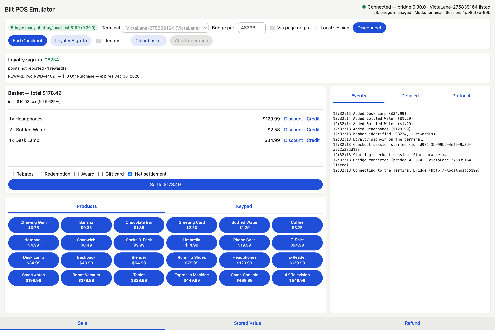

# Register emulator (browser)

A Vite + React + TypeScript port of the Compose desktop emulator in
[`emulator/`](../../../emulator) onto `@bilt/pos-sdk`, `@bilt/pos-react` and the Terminal Bridge.
It has the desktop's panel structure and actions: the same connection card and action row, loyalty
sign-in card, basket card with its settlement toggles, Sale / Stored Value / Refund tabs, log panel,
recovery and outcome dialogs, the same mock catalog, the same New Jersey tax policy and the same
persisted sale records. [`PARITY.md`](PARITY.md) maps every desktop field, action and control onto
this app and lists the deliberate differences.



## Run it

One command starts a Terminal Bridge and the emulator together, from the repository root:

```sh
./gradlew :emulator:browser:runWithBridge -PterminalHost=192.168.4.108   # a LAN terminal
./gradlew :emulator:browser:runWithBridge -Plocal                        # local sessions only
scripts/browser-emulator.sh --terminal 192.168.4.108                     # same, without Gradle
scripts/browser-emulator.sh --local
```

Both write a development bridge config (the terminal unencrypted with `trustAll`, as development
terminals accept), start the bridge, wait for its `/health`, start the dev server on
`http://127.0.0.1:5173` and open it; Ctrl-C stops both. The page comes up in the session mode the
bridge was configured for (`VITE_BILT_SESSION_MODE`), over whatever an earlier launch saved in
Settings. Either port already in use (a tray bridge, another
dev server) stops the launch rather than pointing the page at a bridge with another config. Options: `-PterminalPort` / `--terminal ip:port`
(default 8443), `-PpoiId` / `--poi-id` (default `DEV-TERMINAL`), `-PbridgePort` / `--port`
(default 48333), `-Pport` / `--web-port` (default 5173), `-PnoOpen` / `--no-open`.
`SKIP_BUILD=1 scripts/browser-emulator.sh ...` skips rebuilding the bridge and the JS packages.

`./gradlew :emulator:browser:run` starts only the dev server, next to
`./gradlew :emulator:desktop:run` for the Compose emulator, when a bridge is already running.

### Manually

Start a host first: the [Terminal Bridge](../../../docs/terminal-bridge.md) on this machine
(`./gradlew :bridge:run --args="--config /path/to/config.json"`; without a terminal it still serves
local sessions), or the Session Host alone. Then:

```sh
cd js
pnpm install
pnpm build                              # the app resolves its siblings through their dist/
pnpm --filter @bilt/pos-emulator dev    # http://localhost:5173
```

The development bridge sends no CORS headers yet, so in development the page reaches the bridge
through its own origin ("Via page origin" on the connection card): Vite proxies `/health` and `/v1`
(HTTP and WebSocket) to `http://127.0.0.1:48333`, and `BRIDGE_URL=http://127.0.0.1:48334 pnpm dev`
retargets it. Unchecked, the page probes `127.0.0.1:<Bridge port>` the way a deployed register does.

The lane identity is configuration, as on the desktop: `VITE_POI_ID` (blank by default), `VITE_SALE_ID`,
`VITE_CURRENCY` and `VITE_STORE_LOCATION` set the defaults; the terminal, port, route and Local
session choice persist in `localStorage`.

The bridge drives exactly one terminal, which the connection card shows as `/health` reports it.
The optional POI id does not pick a terminal: it is passed through as the Nexo `POIID` (the
bridge's default when blank) and recorded on each sale.

## Using it

The page probes the bridge and connects once it answers. **Start Checkout** opens one session per
customer (with **Identify**, the terminal prompts for loyalty sign-in right after); **End Checkout**
closes it, and a fully collected settlement ends it automatically. **Loyalty Sign-In** prompts again
on demand, **Clear basket** discards every line with its pending gift-card loads and returns, and
**Abort operation** stops whatever is on the terminal (or answers an open recovery prompt with
Abort).

- **Sale**: the Products grid, and the Keypad for an amount the catalog does not carry (✓ rings it;
  tap a custom basket line to re-price it as you type; ✓ at zero drops it).
- **Basket**: per-line **Discount** (replaces the line's register discount; 0 clears) and
  **Credit** (a credit line tied to the sale line), then Rebates, Redemption, Award, Gift card and
  Net settlement, and **Settle**. A failed charge-side step opens the recovery dialog with the
  desktop's choices; the outcome popup carries the summary and the terminal's receipt.
- **Stored Value**: balance inquiry, activation with a zero balance, and a gift-card purchase rung
  into the basket and loaded at settlement. **Read card** fills the card field from a terminal read.
- **Refund**: completed sales from IndexedDB. **Full amount** voids every standing movement of the
  sale on a fresh session (no checkout open); **Selected items** rings the checked lines, capped at
  what earlier refunds left, into the active checkout as returns, settled against the original card
  (or gift card) leg, with any shortfall of a netted tender paid out by the register.
- **Log**: Events (one line per action and answer), Detailed (with failure causes), Protocol (the
  HTTP requests to the bridge with their bodies, and the session events it streams back).

## Tests

`pnpm --filter @bilt/pos-emulator test` runs the UI tests against the SDK's in-memory `BiltPos`
double with IndexedDB from `fake-indexeddb`, querying by the desktop's labels.
`pnpm --filter @bilt/pos-emulator test:contract` drives the real Session Host and the scripted
terminal of the SDK's contract suite (needs a JDK 21): a sale whose rebate is re-taxed and whose
declined charge is retried through the recovery decision, the sale persisted, a gift-card tender,
and an item return of the persisted sale from a later session. `BILT_HOST_LOG=/path` keeps the
host's output.
